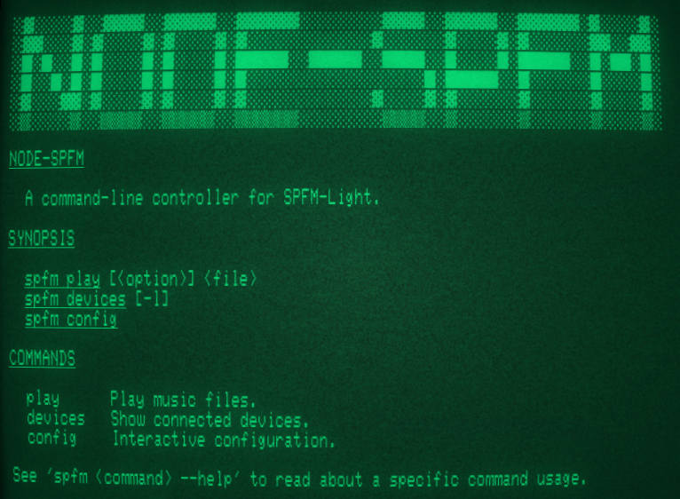

# node-spfm [](https://badge.fury.io/js/node-spfm)


A command-line controller for [SPFM Light](http://www.pyonpyon.jp/~gasshi/fm/spfmlight.html).



This screen shot is node-spfm running under [cool-retro-term](https://github.com/Swordfish90/cool-retro-term).

# Feature

- Software clock adjustment. Frequency of tones will be automatically adjusted according to the clock frequency. 
- Deep inter-chip conversion. For example,
  - Convert SN76489 vgm to YM2203 and YM2608 module.
  - Convert YM2612 vgm to YM2608 module (DAC stream to ADPCM conversion is also supported).
- Suppress click noise on stop.

# Requirements

- macOS or Linux
- Node 10 or later
- SPFM Light and RE:Birth module

This program works also on Windows 10 with proper console (ex. bash console in Visual Studio Code), however, playback speed is not stabilized.

# Supported File Types

- Video Game Music Files (.vgm, .vgz)
- KSS Files (.kss)                    
- MGSDRV Files (.mgs)                 
- MuSICA / Kinrou5 Files (.bgm)       
- MPK Files (.mpk)                    
- OPLL Driver Files (.opx)            
- M3U Playlist

# Supported Modules

- AY-3-8910 (PSG)  
- YM2151 (OPM)
- YM2203 (OPN)    
- YM2608 (OPNA)   
- YM3526 (OPL)    
- YM3812 (OPL2)  
- YM2413 (OPLL)   

# Install

Node.js 10 or later is required.

```sh
npm install -g node-spfm
```

# Usage

```sh
SYNOPSIS

  spfm play [<option>] <file> 
  spfm devices [-l]           
  spfm config                 

COMMANDS

  play      Play music files.          
  devices   Show connected devices.    
  config    Interactive configuration. 

See 'spfm <command> --help' to read about a specific command usage.
```

# Keys
- Cursor Left/Right - Down/Up playback speed. 
- Cursor Down - Reset playback speed.       
- R - Restart current Track                   
- PageUp/B - Previous Track            
- PageDown/N - Next Track        
- Shift + PageUp/B - Previous 10 Tracks
- Shift + PageDown/N - Next 10 Tracks

# M3U KSS Extension Support
`spfm play` command accepts the extended M3U file contains KSS song index and title.
The entry of the extended M3U is comma-separated value as following.

```
<filename>::KSS,<song>,<title>
```

- `<filename>` specifies relative path for KSS. The file extension must be kss or zip.
- `<song>` specifies song index in hex ($00,$01,...) or decimal (0,1,2...) format.

Example of extended M3U is like this:

```
foo.kss::KSS,$80,Foo Song 128 Title
foo.kss::KSS,$81,Foo Song 129 Title
bar.zip::KSS,$01,Bar Title
```
